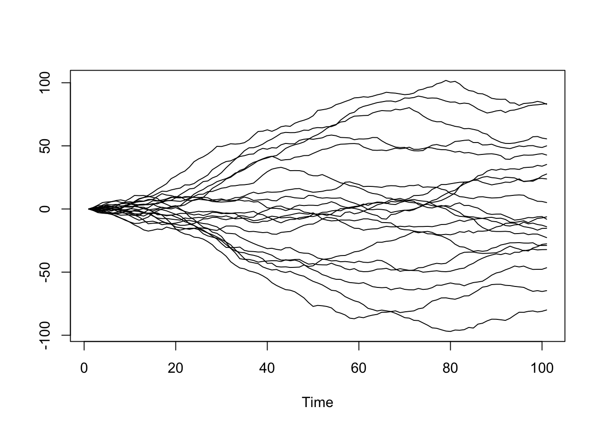
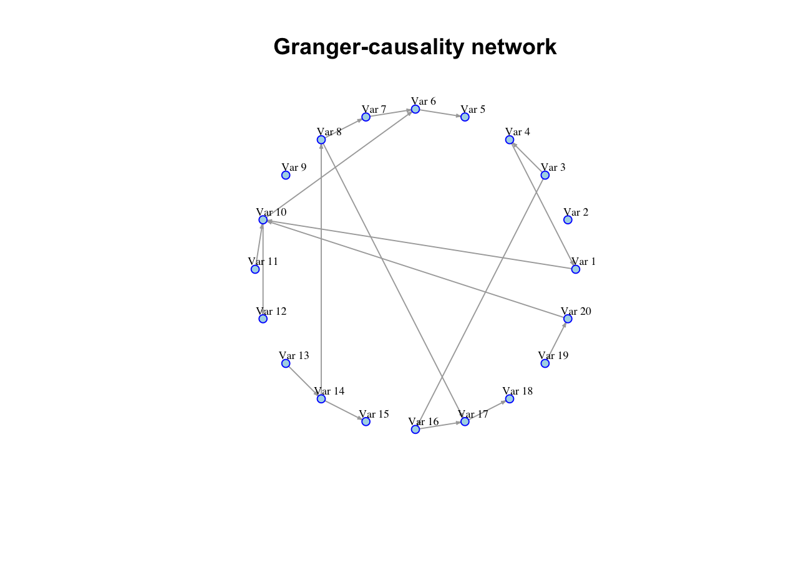
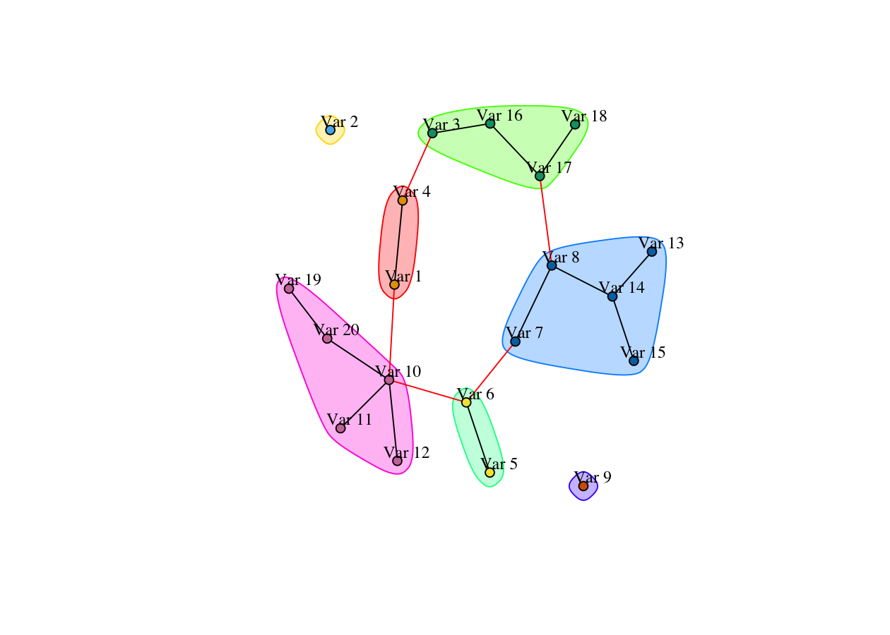

<!-- README.md is generated from README.Rmd. Please edit README.Rmd and then knit it. -->

# HDGCvar

<!-- badges: start -->

[](https://www.gnu.org/licenses/gpl-3.0.html)
<!-- badges: end -->

`HDGCvar` provides tools for Granger-causality testing in
high-dimensional vector autoregressive models. The package implements
post-double-selection procedures for stationary VARs, as well as
lag-augmented post-double-selection procedures for persistent,
integrated, and cointegrated VARs. In the latter case, the lag
augmentation is applied only to the Granger-causing variable or block
being tested, rather than to the full high-dimensional system. This
partial augmentation is the key feature that keeps the procedure
feasible in high dimensions. The package also includes routines for
testing multiple Granger-causality relations and for constructing
Granger-causality networks.

Additional functionality is available for realized-volatility
applications based on heterogeneous VAR specifications, including
volatility spillover networks and networks of realized volatilities
conditional on realized correlations.

## Installation

You can install `HDGCvar` from GitHub with:

``` r
# install.packages("devtools")
devtools::install_github("Marga8/HDGCvar")
```

## Related papers

The main functions in `HDGCvar` are based on two papers:

1.  Hecq, A., Margaritella, L. and Smeekes, S. (2023). “Granger
    Causality Testing in High-Dimensional VARs: A Post-Double-Selection
    Procedure.” *Journal of Financial Econometrics*, 21(3), 915–958.

2.  Hecq, A., Margaritella, L. and Smeekes, S. “Inference in Persistent
    High-Dimensional Vector Autoregressions.” Manuscript.

The stationary high-dimensional VAR and HVAR routines are based mainly
on the first paper. The lag-augmented routines for persistent and
potentially nonstationary systems are based on the second paper.

## Background

Granger causality concerns conditional predictive content. A variable
`X` is said to Granger-cause a variable `Y`, relative to an information
set, if past values of `X` improve the prediction of `Y` after
conditioning on the remaining available variables.

In high-dimensional systems, conditioning on a rich information set is
attractive because it reduces the risk of detecting indirect or spurious
predictive links. At the same time, standard VAR estimation becomes
infeasible or unstable when the number of variables and lags is large
relative to the sample size. `HDGCvar` addresses this problem by
combining penalized regression, variable selection, and post-selection
inference.

For persistent time series, additional complications arise because the
system may contain unit roots, near unit roots, or cointegrating
relations. The lag-augmented functions in `HDGCvar` allow users to
perform inference in levels without first deciding, through pre-testing,
which variables should be differenced. Importantly, the augmentation is
restricted to the Granger-causing variable or block of variables
entering the null hypothesis, not to all variables in the VAR.

## Which function should I use?

| Setting | Main function(s) |
|----|----|
| Single Granger-causality test, stationary VAR | `HDGC_VAR_I0` |
| Multiple Granger-causality tests, stationary VAR | `HDGC_VAR_multiple_I0`, `HDGC_VAR_multiple_pairs_I0` |
| Full Granger-causality network, stationary VAR | `HDGC_VAR_all_I0` |
| Single Granger-causality test, persistent VAR | `HDGC_VAR` |
| Multiple Granger-causality tests, persistent VAR | `HDGC_VAR_multiple`, `HDGC_VAR_multiple_pairs` |
| Full Granger-causality network, persistent VAR | `HDGC_VAR_all` |
| Single Granger-causality test, realized-volatility HVAR | `HDGC_HVAR` |
| Full realized-volatility spillover network | `HDGC_HVAR_all` |
| Realized-volatility network conditional on realized correlations | `HDGC_HVAR_RV_RCoV_all` |

## Stationary high-dimensional VARs

If the time series can be treated as stationary, use the stationary VAR
functions:

- `HDGC_VAR_I0`
- `HDGC_VAR_multiple_I0`
- `HDGC_VAR_multiple_pairs_I0`
- `HDGC_VAR_all_I0`

The main inputs are:

- `GCpair` or `GCpairs`: the Granger-causality relation(s) to test. Each
  relation specifies the Granger-caused variable, `GCto`, and the
  Granger-causing variable, `GCfrom`.
- `data`: a data matrix or data frame with one time series per column.
- `p`: the VAR lag length. If the lag length is not imposed directly,
  `lags_upbound()` can be used to estimate an empirical upper bound.
- `bound`: a lower bound on the lasso penalty, expressed through the
  maximum number of variables that can be selected in each first-stage
  regression. The default is `0.5 * nrow(data)`.
- `parallel`: whether to use parallel computing.
- `n_cores`: the number of cores used when `parallel = TRUE`.

The function `HDGC_VAR_all_I0` can be used to test all bivariate
Granger-causality relations in a dataset and to construct a
Granger-causality network.

## Persistent and nonstationary high-dimensional VARs

If the system may contain persistent, integrated, or cointegrated
series, use the lag-augmented functions:

- `HDGC_VAR`
- `HDGC_VAR_multiple`
- `HDGC_VAR_multiple_pairs`
- `HDGC_VAR_all`

These functions implement a lag-augmented post-double-selection
procedure. The augmentation is restricted to the Granger-causing
variable or block being tested. Hence, the procedure avoids the
parameter proliferation that would arise from augmenting every variable
in a high-dimensional VAR.

The additional input is:

- `d`: the number of augmenting lags added to the Granger-causing
  variable or block. It should be chosen to reflect the maximum
  suspected order of integration. Using a value of `d` larger than
  strictly needed is conservative, although it may reduce power.

In many macroeconomic and financial applications, `d = 2` is a
conservative default. When `p <= d`, the package returns a warning
because, in some designs, the first-stage post-double-selection
regressions may not contain enough own-lag information to rule out
spurious-regression issues. This warning should be interpreted as a
diagnostic rather than as an automatic rejection of the specification.
In particular, `p = 2` and `d = 2` is a feasible lag-augmented
specification when the series are at most I(1).

The lag length `p` can be imposed by the user or selected using:

``` r
lags_upbound(data, p_max = 10)
```

This function estimates an empirical upper bound for the lag length
using information criteria applied to univariate autoregressions.

## Realized-volatility HVARs

`HDGCvar` also includes functions for Granger-causality testing among
realized volatilities using heterogeneous VAR specifications. These
models use daily, weekly, and monthly volatility components, following
the heterogeneous autoregressive structure of Corsi (2009).

For realized-volatility applications, use:

- `HDGC_HVAR`
- `HDGC_HVAR_multiple`
- `HDGC_HVAR_all`

The main inputs are the same as for the stationary VAR functions, except
that the HVAR lag structure is fixed by construction. The option
`log = TRUE` can be used to log-transform realized-volatility series,
which is typically recommended.

The HVAR functions return different versions of the LM test, including
the asymptotic chi-square version, the finite-sample corrected F-test,
and a heteroskedasticity-robust asymptotic chi-square version.

## Realized volatilities conditional on realized correlations

To condition realized-volatility spillover networks on realized
correlations, use:

- `HDGC_HVAR_RV_RCoV_all`
- `HDGC_HVAR_RVCOV`
- `HDGC_HVAR_multiple_RVCOV`

The main inputs are:

- `realized_variances`: a matrix of realized variances.
- `realized_covariances`: a matrix of realized covariances.
- `fisher_transf`: whether to Fisher-transform realized correlations.
  The default is `TRUE`.
- `log`: whether to log-transform the realized-volatility series. The
  default is `TRUE`.
- `bound`: the selection bound used in the first-stage regressions.
- `parallel`: whether to use parallel computing.
- `n_cores`: the number of cores used when `parallel = TRUE`.

## Plotting Granger-causality networks

Networks created by `HDGC_VAR_all_I0`, `HDGC_VAR_all`, `HDGC_HVAR_all`,
or `HDGC_HVAR_RV_RCoV_all` can be plotted with:

- `Plot_GC_all`

The main inputs are:

- `Comb`: the output of one of the network-estimation functions.
- `Stat_type`: the statistic used to determine edges. The default is
  `"FS_cor"`, the finite-sample corrected F-test. Alternatives include
  `"Asymp"` and `"Asymp_Robust"`.
- `alpha`: the significance level. The default is `0.01`.
- `multip_corr`: optional multiple-testing correction using
  `stats::p.adjust()` or the APF/FDR procedure.
- `cluster`: optional network clustering using
  `igraph::cluster_edge_betweenness()`.
- `...`: additional plotting arguments passed to `igraph`.

## Data

The package contains three example datasets:

- `sample_dataset_I0`: a simulated stationary high-dimensional VAR
  dataset.
- `sample_dataset_I1`: a simulated integrated dataset obtained from the
  stationary system by inverse differencing.
- `sample_RV`: simulated realized-volatility series generated from
  heterogeneous autoregressive dynamics.

These datasets are intended for illustrating the main functions and
plotting routines.

## Example

The following example simulates a persistent high-dimensional VAR
system, selects an empirical lag upper bound, tests one
Granger-causality relation, estimates the full network, and plots it.

``` r
library(HDGCvar)
library(igraph)
#> 
#> Attaching package: 'igraph'
#> The following objects are masked from 'package:stats':
#> 
#>     decompose, spectrum
#> The following object is masked from 'package:base':
#> 
#>     union

# Simulate a stationary VAR(1)
SimulVAR <- function(T_, g) {
  coef1 <- matrix(NA, nrow = g, ncol = g)

  for (i in seq_len(g)) {
    for (j in seq_len(g)) {
      coef1[i, j] <- ((-1)^(abs(i - j))) * (0.4^(abs(i - j) + 1))
    }
  }

  presample <- 1
  T_new <- T_ + presample

  eps <- matrix(rnorm(ncol(coef1) * T_new, 0, 1), nrow = ncol(coef1))
  X <- matrix(nrow = ncol(coef1), ncol = T_new)
  X[, 1] <- eps[, 1]

  for (t in 2:T_new) {
    X[, t] <- coef1 %*% X[, t - 1] + eps[, t]
  }

  t(X[, (1 + presample):T_new])
}

# Simulate persistent data by inverse differencing
set.seed(123)

g <- 20
dataset_I0 <- as.matrix(SimulVAR(100, g))
dataset <- as.matrix(diffinv(dataset_I0))
colnames(dataset) <- paste("Var", seq_len(g))

# Visual inspection
ts.plot(dataset)
```



``` r

# Select an empirical upper bound for the lag length
selected_lag <- lags_upbound(dataset, p_max = 10)
selected_lag
#> [1] 2

# Test whether Var 5 Granger-causes Var 1
interest_variables <- list("GCto" = "Var 1", "GCfrom" = "Var 5")

HDGC_VAR(
  GCpair = interest_variables,
  data = dataset,
  p = selected_lag,
  d = 2,
  bound = 0.5 * nrow(dataset),
  parallel = TRUE,
  n_cores = NULL
)
#> Warning in HDGC_VAR(GCpair = interest_variables, data = dataset, p = selected_lag, : To avoid spurious regression problems in the post-double-selection steps,
#>             unless you are certain that your series are maximum I(1), you might want to consider increasing the lag length p to be larger than d
#> $tests
#>             Asymp    FS_cor
#> LM_stat 2.2245113 0.8919124
#> p_value 0.3288164 0.4141173
#> 
#> $selections
#>  Var 1 l1  Var 2 l1  Var 3 l1  Var 4 l1  Var 6 l1  Var 7 l1  Var 8 l1  Var 9 l1 
#>      TRUE      TRUE      TRUE      TRUE      TRUE     FALSE      TRUE      TRUE 
#> Var 10 l1 Var 11 l1 Var 12 l1 Var 13 l1 Var 14 l1 Var 15 l1 Var 16 l1 Var 17 l1 
#>     FALSE     FALSE     FALSE      TRUE     FALSE     FALSE      TRUE     FALSE 
#> Var 18 l1 Var 19 l1 Var 20 l1  Var 1 l2  Var 2 l2  Var 3 l2  Var 4 l2  Var 6 l2 
#>     FALSE     FALSE      TRUE      TRUE      TRUE     FALSE     FALSE      TRUE 
#>  Var 7 l2  Var 8 l2  Var 9 l2 Var 10 l2 Var 11 l2 Var 12 l2 Var 13 l2 Var 14 l2 
#>     FALSE      TRUE     FALSE     FALSE     FALSE     FALSE     FALSE     FALSE 
#> Var 15 l2 Var 16 l2 Var 17 l2 Var 18 l2 Var 19 l2 Var 20 l2 
#>      TRUE      TRUE      TRUE     FALSE     FALSE     FALSE

# Test multiple Granger-causality relations
mult_interest_variables <- list(
  list("GCto" = "Var 7", "GCfrom" = "Var 19"),
  list("GCto" = "Var 4", "GCfrom" = "Var 16")
)

HDGC_VAR_multiple(
  data = dataset,
  GCpairs = mult_interest_variables,
  p = selected_lag,
  d = 2,
  bound = 0.5 * nrow(dataset),
  parallel = TRUE,
  n_cores = NULL
)
#> $tests
#> , , GCtests = Var 19 -> Var 7
#> 
#>          type
#> stat          Asymp    FS_cor
#>   LM_stat 0.8564206 0.3340397
#>   p_value 0.6516743 0.7170851
#> 
#> , , GCtests = Var 16 -> Var 4
#> 
#>          type
#> stat          Asymp    FS_cor
#>   LM_stat 0.2839762 0.1174474
#>   p_value 0.8676316 0.8893403
#> 
#> 
#> $selections
#> $selections$`Var 19 -> Var 7`
#>  Var 1 l1  Var 2 l1  Var 3 l1  Var 4 l1  Var 5 l1  Var 6 l1  Var 7 l1  Var 8 l1 
#>     FALSE      TRUE     FALSE      TRUE     FALSE     FALSE      TRUE      TRUE 
#>  Var 9 l1 Var 10 l1 Var 11 l1 Var 12 l1 Var 13 l1 Var 14 l1 Var 15 l1 Var 16 l1 
#>     FALSE     FALSE      TRUE      TRUE     FALSE     FALSE      TRUE      TRUE 
#> Var 17 l1 Var 18 l1 Var 20 l1  Var 1 l2  Var 2 l2  Var 3 l2  Var 4 l2  Var 5 l2 
#>     FALSE      TRUE      TRUE     FALSE     FALSE     FALSE      TRUE      TRUE 
#>  Var 6 l2  Var 7 l2  Var 8 l2  Var 9 l2 Var 10 l2 Var 11 l2 Var 12 l2 Var 13 l2 
#>      TRUE      TRUE     FALSE     FALSE     FALSE     FALSE     FALSE     FALSE 
#> Var 14 l2 Var 15 l2 Var 16 l2 Var 17 l2 Var 18 l2 Var 20 l2 
#>     FALSE      TRUE      TRUE     FALSE      TRUE      TRUE 
#> 
#> $selections$`Var 16 -> Var 4`
#>  Var 1 l1  Var 2 l1  Var 3 l1  Var 4 l1  Var 5 l1  Var 6 l1  Var 7 l1  Var 8 l1 
#>     FALSE      TRUE     FALSE      TRUE      TRUE      TRUE     FALSE      TRUE 
#>  Var 9 l1 Var 10 l1 Var 11 l1 Var 12 l1 Var 13 l1 Var 14 l1 Var 15 l1 Var 17 l1 
#>     FALSE      TRUE     FALSE     FALSE     FALSE      TRUE      TRUE     FALSE 
#> Var 18 l1 Var 19 l1 Var 20 l1  Var 1 l2  Var 2 l2  Var 3 l2  Var 4 l2  Var 5 l2 
#>     FALSE     FALSE     FALSE     FALSE     FALSE     FALSE      TRUE     FALSE 
#>  Var 6 l2  Var 7 l2  Var 8 l2  Var 9 l2 Var 10 l2 Var 11 l2 Var 12 l2 Var 13 l2 
#>     FALSE     FALSE     FALSE     FALSE     FALSE      TRUE      TRUE      TRUE 
#> Var 14 l2 Var 15 l2 Var 17 l2 Var 18 l2 Var 19 l2 Var 20 l2 
#>     FALSE      TRUE     FALSE     FALSE     FALSE     FALSE

# Estimate the full Granger-causality network
network <- HDGC_VAR_all(
  data = dataset,
  p = selected_lag,
  d = 2,
  bound = 0.5 * nrow(dataset),
  parallel = TRUE,
  n_cores = NULL
)

# Plot the estimated network
Plot_GC_all(
  network,
  Stat_type = "FS_cor",
  alpha = 0.01,
  multip_corr = list(FALSE),
  directed = TRUE,
  layout = layout.circle,
  main = "Granger-causality network",
  edge.arrow.size = 0.2,
  vertex.size = 5,
  vertex.color = "lightblue",
  vertex.frame.color = "blue",
  vertex.label.color = "black",
  vertex.label.cex = 0.6,
  vertex.label.dist = 1,
  edge.curved = 0,
  cluster = list(TRUE, 5, "black", 0.8, 1, 0)
)
#> Warning: Same attribute for columns and rows, row names are ignored
```



## Notes on choosing `p` and `d`

The lag length `p` controls the dynamic order of the VAR, while `d`
controls the number of augmenting lags used to guard against unknown
persistence. These augmenting lags are added only to the Granger-causing
variable or block being tested. The value of `d` should reflect the
maximum suspected order of integration. For example, if the variables
are at most I(1), then `d = 2` is a conservative over-augmentation that
can also provide a safeguard against near-I(2)-type persistence,
although possibly at the cost of some power.

In the post-double-selection step, the first-stage regressions should
not be spurious. If `p <= d`, the package returns a warning because this
can be problematic in some nonstationary designs. The warning does not
automatically imply that the result is invalid; it signals that the user
should check whether the chosen combination of `p` and `d` is
appropriate for the application. The specification `p = 2, d = 2`, for
example, is appropriate when the simulated or empirical series are at
most I(1).

## References

- Belloni, A., Chernozhukov, V. and Hansen, C. (2014). “Inference on
  treatment effects after selection among high-dimensional controls.”
  *The Review of Economic Studies*, 81(2), 608–650.

- Corsi, F. (2009). “A simple approximate long-memory model of realized
  volatility.” *Journal of Financial Econometrics*, 7(2), 174–196.

- Granger, C. W. J. (1969). “Investigating causal relations by
  econometric models and cross-spectral methods.” *Econometrica*, 37(3),
  424–438.

- Hecq, A., Margaritella, L. and Smeekes, S. (2023). “Granger Causality
  Testing in High-Dimensional VARs: A Post-Double-Selection Procedure.”
  *Journal of Financial Econometrics*, 21(3), 915–958.

- Hecq, A., Margaritella, L. and Smeekes, S. “Inference in Persistent
  High-Dimensional Vector Autoregressions.” Manuscript.

- Newman, M. E. J. and Girvan, M. (2004). “Finding and evaluating
  community structure in networks.” *Physical Review E*, 69(2), 026113.

- Quatto, P., Margaritella, L., et al. (2020). “Brain networks
  construction using Bayes FDR and average power function.” *Statistical
  Methods in Medical Research*, 29(3), 866–878.
